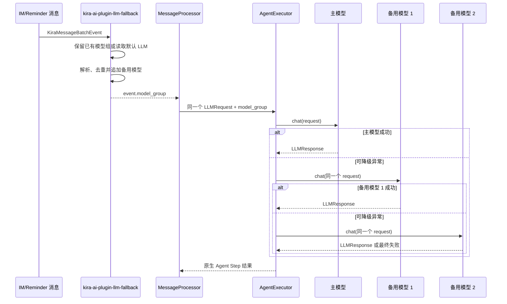

# KiraAI LLM Fallback Plugin

一个尽量贴合 KiraAI 原生架构的 LLM 故障转移插件。当主模型发生 Provider/API 级调用失败时，KiraAI 会按配置顺序尝试备用模型；插件不替换 Agent Loop，不修改全局默认模型，也不单独维护对话、工具或缓存流程。

## 一、结论与设计原则

KiraAI 的 `KiraMessageBatchEvent` 已提供 `model_group`，`AgentExecutor` 也已实现模型组的顺序调用。因此本插件只负责在 LLM 请求建立之前组装模型组：

```text
系统默认主模型 / 其他插件已有模型组
    → 第一备用模型
    → 第二备用模型
```

核心原则：

- **复用主项目流程**：实际调用、异常捕获、Tool Calling、XML 输出、记忆更新和遥测仍由 KiraAI 完成。
- **事件级生效**：模型组只属于当前 `KiraMessageBatchEvent`，不会修改 `models.default_llm`。
- **无全局切换状态**：每个新事件重新读取当前默认主模型；并发会话互不共享“当前模型”。
- **尊重其他插件**：如果其他插件已经提供模型组，本插件保留其顺序，只在末尾追加备用模型。
- **最小侵入**：不注册 Provider、Tool、Tag、独立 API 或插件页面，不 monkey patch 模型客户端。
- **安全失效**：备用模型为空、重复、被删除或暂时不可用时跳过；不阻断原有消息链路。

## 二、主项目接入位置

插件使用低优先级 `@on.im_batch_message(priority=Priority.LOW)`。这个 Hook 位于消息合并之后、主项目读取 `event.model_group` 和构造 `LLMRequest` 之前。



插件不会等待 `@on.exception()` 再决定模型，因为模型选择必须在调用发生前完成，而且当前核心只会在所有候选模型都失败后发出 Provider 异常事件。`event.model_group` 是更早、更原生的扩展点。

## 三、安装与配置

### 安装

将整个目录复制到 KiraAI 的用户插件目录：

```text
KiraAI/
└── data/
    └── plugins/
        └── kira-ai-plugin-llm-fallback/
            ├── main.py
            ├── manifest.json
            ├── schema.json
            ├── README.md
            └── tests/
```

该插件没有额外第三方运行依赖。安装或更新后，在 KiraAI WebUI 中启用/重载插件。

### WebUI 下拉选择

`schema.json` 使用主项目原生的 `model_select`：

- `fallback_model_1`：第一备用 LLM。
- `fallback_model_2`：第二备用 LLM。

WebUI 会从主项目现有 Provider/模型配置生成 LLM 下拉框。插件保存的是 `provider_id:model_id`，运行时通过 `PluginContext.get_llm_client()` 获取原生客户端，因此：

- 不需要在插件里重复填写 API Key、Base URL 或模型参数。
- Provider 的认证、代理、超时、Temperature 和 `extra_body` 等继续使用主项目配置。
- 只显示并选择主项目已经登记的 LLM。
- 删除或禁用已选择的 Provider/模型后，该备用项会被跳过并记录一次告警。
- 两个备用位置都可以留空；全部留空时插件保持加载但不介入消息流程。

### 模型组组合规则

无其他插件设置模型组时：

```text
系统 default_llm → fallback_model_1 → fallback_model_2
```

已有模型组 `[会话模型, 业务备用模型]` 时：

```text
会话模型 → 业务备用模型 → fallback_model_1 → fallback_model_2
```

相同 `(provider_id, model_id)` 只保留第一次出现的位置。第一备用留空而第二备用有效时，第二备用会直接接在当前模型组之后。

## 四、故障转移语义

插件不自行捕获模型调用异常。当前 KiraAI `AgentExecutor` 会对以下 Provider/API 级异常尝试下一个模型：

- `openai.APIStatusError`
- `openai.APITimeoutError`
- `openai.APIConnectionError`
- `core.provider.ProviderAPIError`

每个模型在一个 Agent Step 内由核心尝试一次；Provider SDK 自身可能还有内部重试策略，本插件不会增加同模型重试。

以下情况不由 MVP 扩大为 fallback：

- Provider 返回了合法但为空的响应。
- 模型正常返回拒绝、内容过滤或无法回答。
- Tool 执行失败、XML 解析失败或消息发送失败。
- `TypeError`、`ValueError`、`RuntimeError` 等程序错误。
- 第三方 Provider 没有把调用错误转换为上述可降级异常。

这样可以避免把插件 bug、参数 bug 或工具副作用错误误判成“模型不可用”。

### Agent Loop 中的模型选择

当前 MVP 采用“每个 Step 从组首开始”的原生策略：

1. Step 1 主模型失败，备用模型 1 成功并请求调用工具。
2. 工具执行完成后进入 Step 2。
3. Step 2 再次先尝试主模型；只有它仍失败时才继续备用链。

因此同一轮可能由备用模型规划工具、主模型在恢复后生成最终回答。该行为不需要全局恢复操作，新事件也始终重新从主模型或已有模型组开始。

## 参考资料

- [KiraAI 插件开发指南](https://docs.kira-ai.top/zh/development/plugins/dev-guide.html)
- [KiraAI Hook 系统](https://docs.kira-ai.top/zh/development/plugins/hooks.html)
- [PluginContext API](https://docs.kira-ai.top/zh/development/plugins/context.html)
- [插件配置系统与 model_select](https://docs.kira-ai.top/zh/development/plugins/config-system.html)
- [KiraAI AgentExecutor](https://github.com/xxynet/KiraAI/blob/8ed62f532243a33938084574e7192f3c5d117d71/core/agent/agent_executor.py)
- [KiraMessageBatchEvent.model_group](https://github.com/xxynet/KiraAI/blob/8ed62f532243a33938084574e7192f3c5d117d71/core/chat/message_utils.py)
